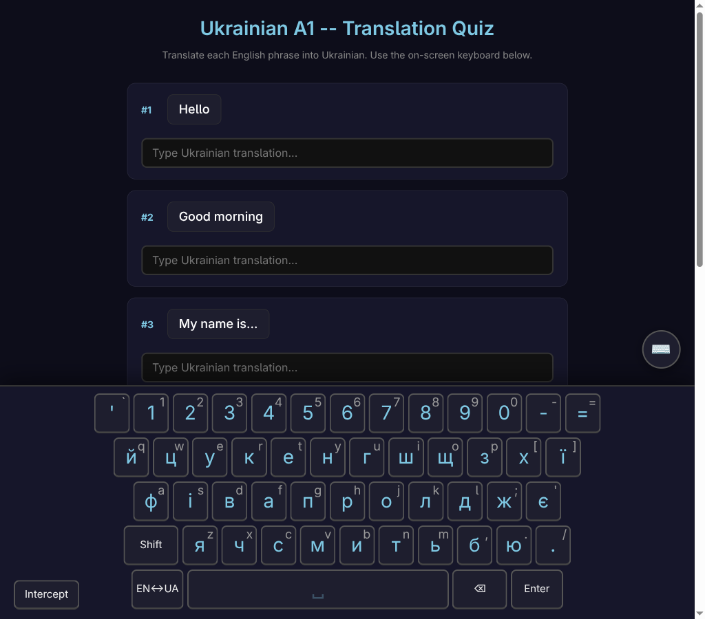
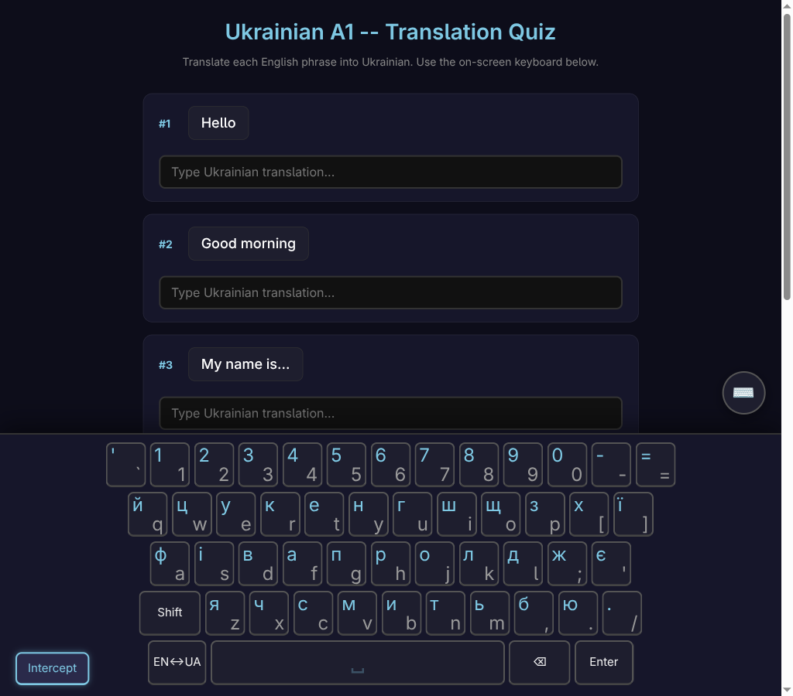
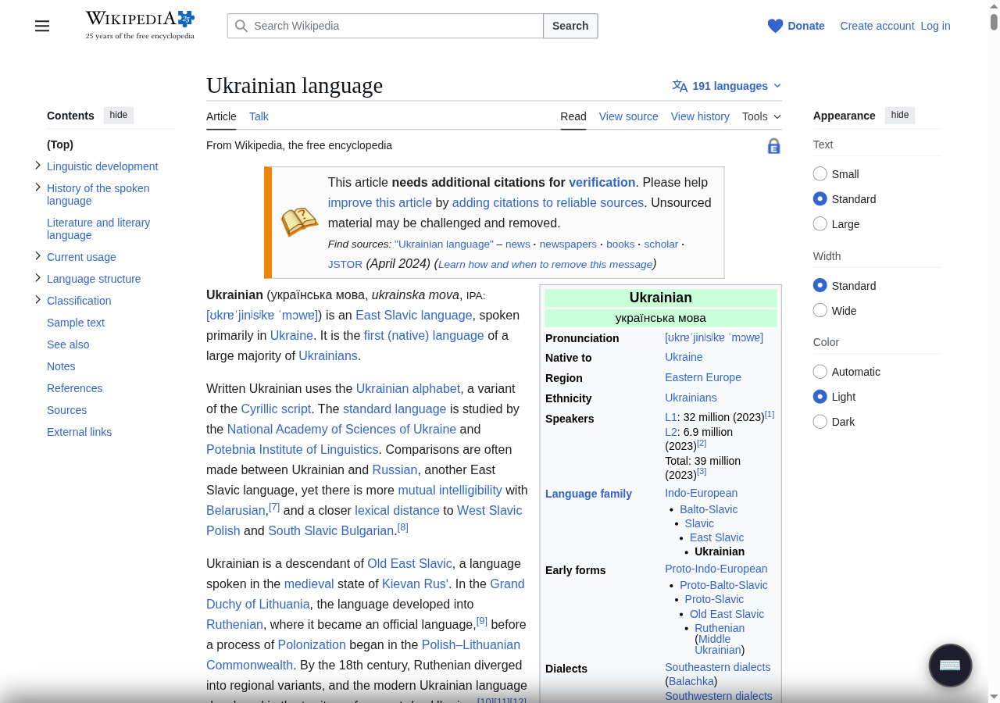

# bilang-slidekeys

A bilingual on-screen keyboard for typing English and Ukrainian (and German, Spanish, French, Italian) on any web page. Slides up like a mobile keyboard, showing both languages on every key.

Built as a zero-dependency web component with Shadow DOM. Distributed as a userscript (Tampermonkey) today; Chrome Web Store extension coming. Works in any framework or plain HTML.

## Demo

https://github.com/grogzoid/bilang-slidekeys/raw/main/docs/videos/livetype-demo.mp4

A short clip of LiveType: typing on a physical QWERTY keyboard produces Ukrainian via the standard ЙЦУКЕН mapping. Source: [`docs/videos/livetype-demo.mp4`](docs/videos/livetype-demo.mp4).

## Screenshots

### Normal mode — Ukrainian active, English in corner


### LiveType mode (default) — physical keyboard produces Ukrainian
Type on your physical keyboard using the standard Ukrainian QWERTY-position layout (ЙЦУКЕН) and Cyrillic appears in the focused input. Optional diagonal key style shows both letters at equal size:



### Embedded on a real page


## Features

- **Bilingual keys** — both Latin and Ukrainian characters visible on every key, active language large, inactive in the corner
- **Slide-up panel** — summoned via a floating ⌨️ button, hotkey (`Ctrl+Shift+Backquote` default), or Tampermonkey menu
- **LiveType mode** (default) — physical keyboard produces Ukrainian using the standard ЙЦУКЕН layout. Honors physical Shift, virtual Shift, and Caps Lock.
- **Pop-out (Picture-in-Picture)** — small ⧉ button moves the keyboard into an OS-level always-on-top window. Sidesteps page layout entirely; works perfectly on WhatsApp Web, Slack, Discord etc. Chromium 116+.
- **4 input modes:**
  - `live-type` (default) — physical keys produce Ukrainian
  - `bound` — virtual key clicks insert into the last-focused input
  - `focus` — virtual key clicks insert into `document.activeElement`
  - `internal` — built-in textarea with copy button
- **Multi-Latin support** — type into German, Spanish, French, or Italian with digraph composition (`ae`→ä, `n~`→ñ, `c,`→ç, `e\``→è, etc.). Globe button cycles through enabled languages.
- **Draggable, dismissable floating button** — position persists across page reloads
- **Configurable hotkey** — edit one line in the userscript header
- **Shadow DOM** — fully encapsulated styles, no conflicts with host page
- **Politeness contract** — host pages can embed `<bilingual-keyboard>` directly; userscript and extension defer to it
- **React wrapper** included

## Installation

### Userscript (Tampermonkey, recommended for end users)

See **[`userscript/INSTALL.md`](userscript/INSTALL.md)** for the step-by-step tutorial with screenshots.

Quick path: install Tampermonkey → open the [raw userscript URL](https://raw.githubusercontent.com/grogzoid/bilang-slidekeys/main/userscript/bilang-slidekeys.user.js) → click Install. Then Tampermonkey menu → "Toggle keyboard here" or hotkey `Ctrl+Shift+\``.

### Embed in your own site (web developers)

See **[`website/TUTORIAL.md`](website/TUTORIAL.md)** for the integration guide.

```html
<script type="module" src="path/to/src/bilingual-keyboard.js"></script>
<bilingual-keyboard active-lang="uk" input-mode="live-type"></bilingual-keyboard>
```

### React

```jsx
import { BilingualKeyboard } from 'bilang-slidekeys/react';

function App() {
  return (
    <BilingualKeyboard
      activeLang="uk"
      inputMode="live-type"
      visible={true}
      onKeyInput={(char, lang) => console.log(char, lang)}
      onLangChange={(lang) => console.log('Language:', lang)}
    />
  );
}
```

## Attributes

| Attribute             | Values                                                | Default     |
|-----------------------|-------------------------------------------------------|-------------|
| `active-lang`         | `en`, `uk`                                            | `uk`        |
| `latin-lang`          | `en`, `de`, `es`, `fr`, `it`                          | `en`        |
| `enabled-latin-langs` | comma-separated list                                  | `en`        |
| `input-mode`          | `bound`, `focus`, `internal`, `live-type`             | `live-type` |
| `live-type-keys`      | `''` or `diagonal`                                    | `''`        |
| `visible`             | boolean attribute                                     | absent      |

## Events

| Event                 | Detail                            |
|-----------------------|-----------------------------------|
| `key-input`           | `{ char, lang, composed? }`       |
| `lang-change`         | `{ lang }`                        |
| `latin-lang-change`   | `{ lang }`                        |
| `visibility-change`   | `{ visible }`                     |

## Demo pages

Serve the repo over HTTP and open `demo/`:

```bash
python3 -m http.server 8080
```

Then http://localhost:8080/demo/ — directory of all demos:

- **Playground** — interactive testbed with all options
- **A1 Ukrainian Quiz** — 10-question translation drill
- **Bilingual Chat** — messaging UI
- **Shevchenko Typewriter** — type "Заповіт" character-by-character
- **Recipe Card Builder** — bilingual content creation
- **Showreel** — auto-playing animated demo

## Documentation

| Doc | Audience |
|---|---|
| [`README.md`](README.md) | Overview (this file) |
| [`PROJECT.md`](PROJECT.md) | Background, problem, goal, approach |
| [`IMPLEMENTATION.md`](IMPLEMENTATION.md) | Architecture, file structure, API surface |
| [`COMPETITORS.md`](COMPETITORS.md) | Competitive landscape (Chrome Web Store + OS-level tools) |
| [`TODO.md`](TODO.md) | Chrome Web Store extension roadmap |
| [`docs/INLINE-PUSHUP.md`](docs/INLINE-PUSHUP.md) | Why inline mode doesn't always push WhatsApp content up |
| [`userscript/INSTALL.md`](userscript/INSTALL.md) | End-user Tampermonkey install tutorial |
| [`website/TUTORIAL.md`](website/TUTORIAL.md) | Web developer integration guide |
| [`review-handoff.md`](review-handoff.md) | Pre-release review checklist for LLM/human reviewers |

## Ukrainian keyboard layout

Uses the standard Ukrainian Windows keyboard layout (ЙЦУКЕН). The mapping is defined in `src/layouts.js` and can be replaced or extended for other language pairs.

## License

MIT
