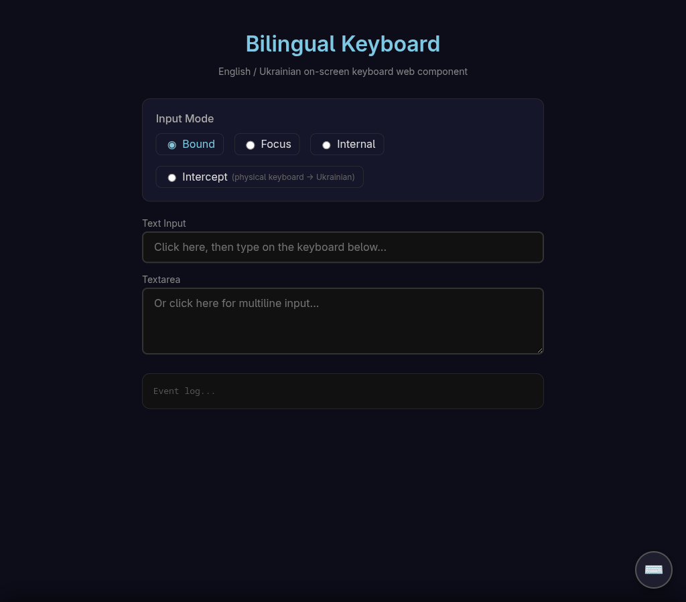

# bilang-slidekeys

A bilingual on-screen keyboard web component for English/Ukrainian input. Slides up from the bottom of the page like a mobile keyboard, showing both language characters on every key.

Built as a zero-dependency web component with Shadow DOM. Works in any framework or plain HTML.

## Screenshots

### Normal mode — Ukrainian active, English in corner


### Intercept mode — physical keyboard transliteration
Type on your English keyboard and get Ukrainian output (or vice versa). Both characters shown at equal size on a diagonal split.


### Demo page with input mode selector


## Features

- **Bilingual keys** — both EN and UK characters visible on every key, active language large, inactive in the corner
- **Slide-up panel** — toggled via a floating button, fixed to the bottom of the viewport
- **Intercept mode** — translates physical keyboard input between EN and UK in real-time (software IME)
- **Language toggle** — swap active language; in intercept mode this also swaps key positions and transliteration direction
- **4 input modes:**
  - `bound` — types into the last-clicked input (default)
  - `focus` — types into `document.activeElement`
  - `internal` — built-in textarea with copy button
  - `intercept` — intercepts physical keystrokes and transliterates them
- **Shift support** — uppercase and shifted symbols for both languages
- **Shadow DOM** — fully encapsulated styles, drop into any page without conflicts
- **React wrapper** included

## Installation

### From a private GitHub repo (git dependency)

```bash
npm install git+ssh://git@github.com:grogzoid/bilang-slidekeys.git
```

### Manual

Copy the `src/` directory into your project.

## Usage

### Vanilla JS / HTML

```html
<script type="module">
  import './node_modules/bilang-slidekeys/src/bilingual-keyboard.js';
</script>

<bilingual-keyboard active-lang="uk" input-mode="bound"></bilingual-keyboard>
```

The keyboard toggle button appears automatically in the bottom-right corner.

### React

```jsx
import { BilingualKeyboard } from 'bilang-slidekeys/react';

function App() {
  return (
    <BilingualKeyboard
      activeLang="uk"
      inputMode="bound"
      visible={true}
      onKeyInput={(char, lang) => console.log(char, lang)}
      onLangChange={(lang) => console.log('Language:', lang)}
    />
  );
}
```

### Attributes

| Attribute     | Values                                        | Default   |
|---------------|-----------------------------------------------|-----------|
| `active-lang` | `"en"`, `"uk"`                                | `"uk"`    |
| `input-mode`  | `"bound"`, `"focus"`, `"internal"`, `"intercept"` | `"bound"` |
| `visible`     | boolean attribute                             | absent    |

### Events

| Event               | Detail                    |
|---------------------|---------------------------|
| `key-input`         | `{ char, lang }`          |
| `lang-change`       | `{ lang }`                |
| `visibility-change` | `{ visible }`             |

## Demo pages

Run a local server and open:

```bash
npx serve .
# or
python3 -m http.server 8080
```

- `demo/index.html` — keyboard demo with mode switcher and event log
- `demo/quiz.html` — A1 Ukrainian translation quiz (10 exercises)

## Ukrainian keyboard layout

Uses the standard Ukrainian Windows keyboard layout (ЙЦУКЕН). The mapping is defined in `src/layouts.js` and can be replaced or extended for other language pairs.

## License

MIT
