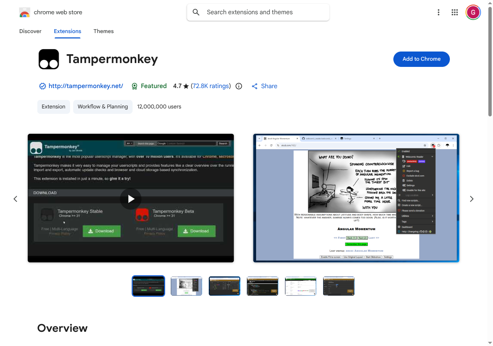
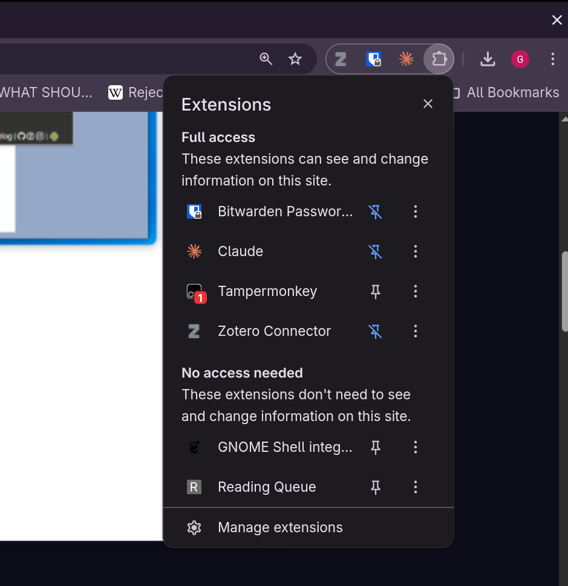
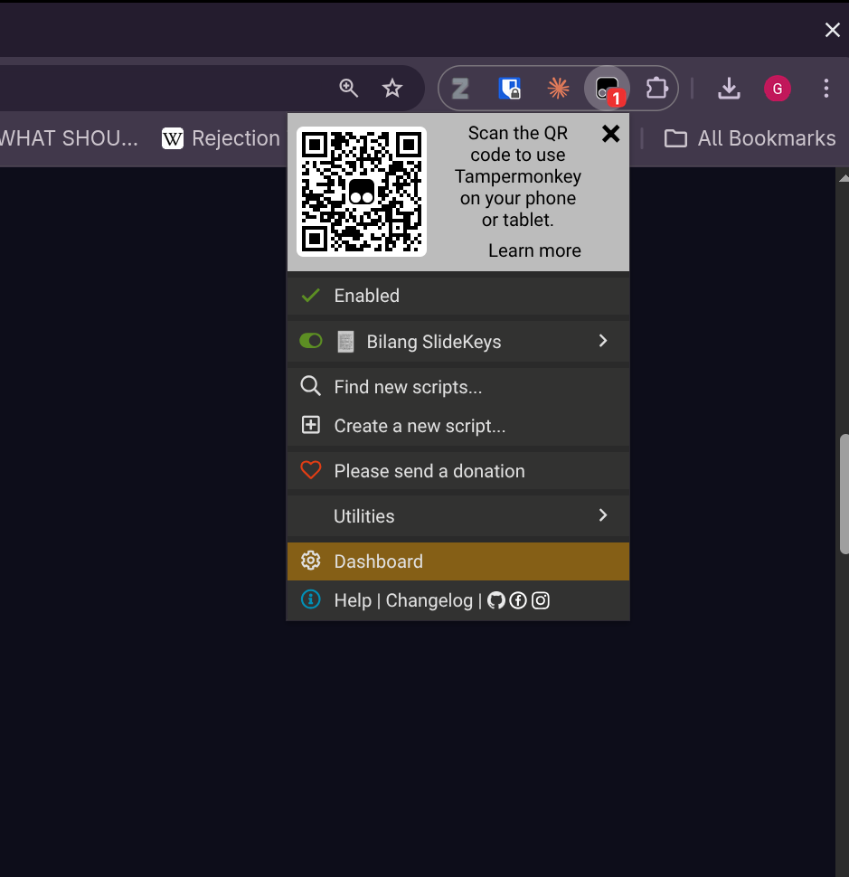
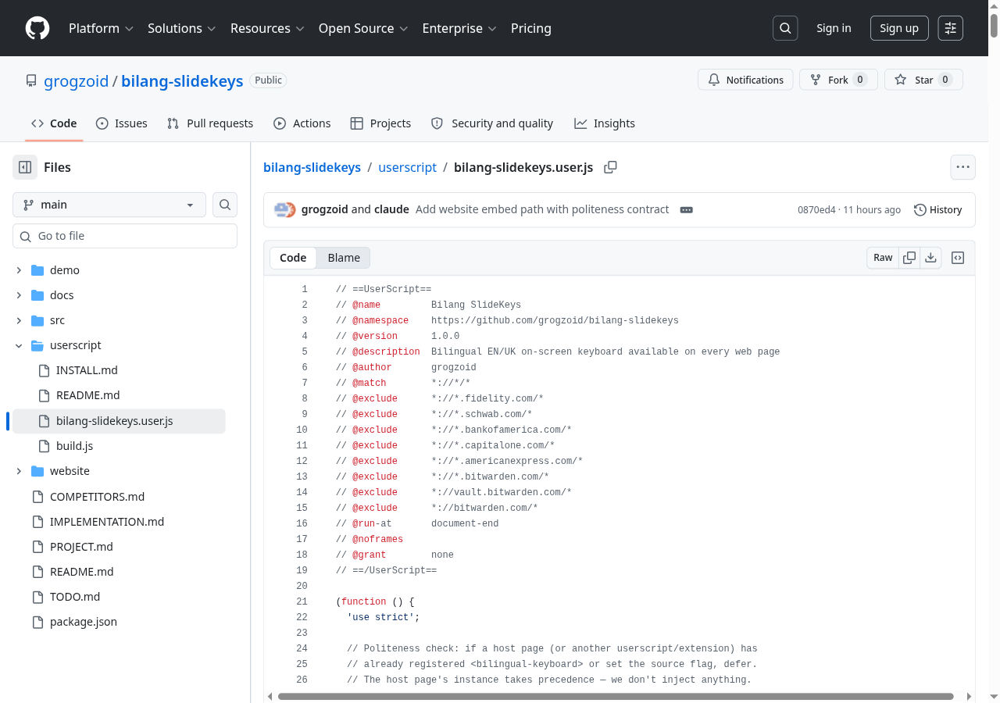
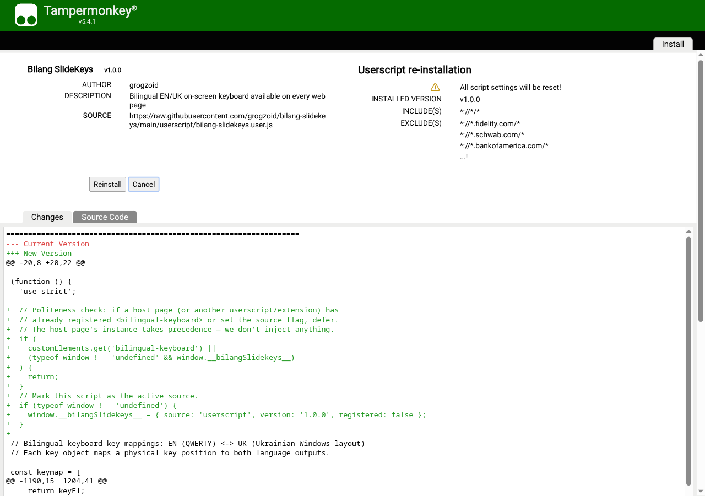
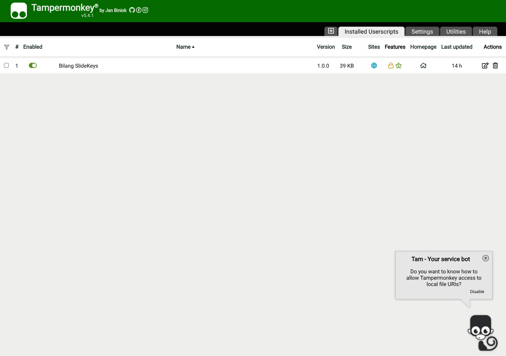
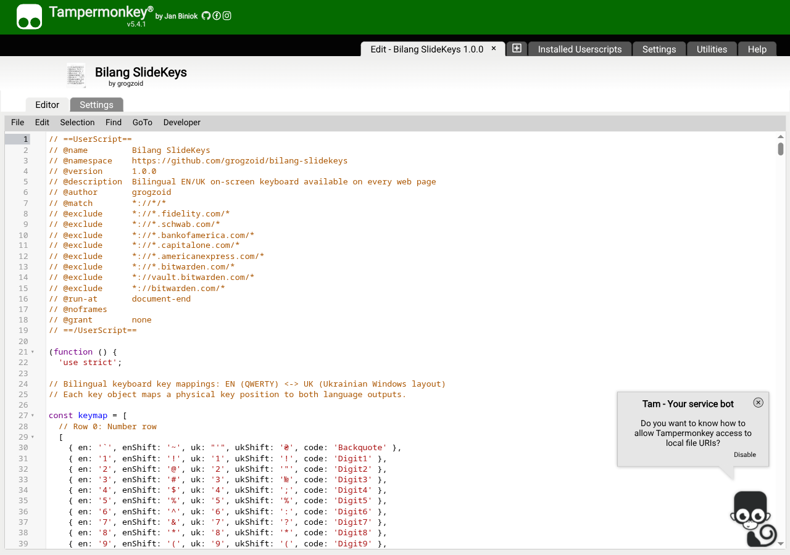
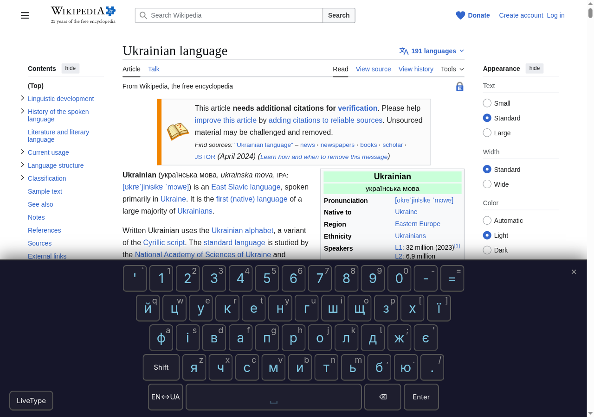

# Install bilang-slidekeys via Tampermonkey

A step-by-step tutorial for installing the userscript in Chrome (or any Chromium browser: Edge, Brave, Arc, Opera). About 5 minutes start to finish.

> **Why a userscript?** Until the Chrome Web Store extension is published, the userscript is the easiest way to use bilang-slidekeys on any website. The script stays out of your way until you summon it — by the hotkey **Ctrl+Shift+\`** (backtick) or via the Tampermonkey extension menu — then a virtual keyboard slides up so you can type Ukrainian.

## Step 1 — Install Tampermonkey

Tampermonkey is a free browser extension that runs userscripts. It's the standard tool for this — over 10 million users.

1. Open the Chrome Web Store: [chromewebstore.google.com](https://chromewebstore.google.com/detail/tampermonkey/dhdgffkkebhmkfjojejmpbldmpobfkfo)
2. Click **Add to Chrome**
3. Confirm the permission prompt



After install, you'll see a small Tampermonkey icon in your browser toolbar (top-right area). If it's hidden, click the puzzle piece icon and pin Tampermonkey to keep it visible.



## Step 2 — Verify Tampermonkey is enabled

Click the Tampermonkey icon. You should see "Dashboard," "Utilities," and other options. If you see a warning about being disabled, follow Tampermonkey's prompts to enable it (Chrome sometimes asks for explicit confirmation).



## Step 3 — Install bilang-slidekeys

The userscript lives at:

**https://github.com/grogzoid/bilang-slidekeys/blob/main/userscript/bilang-slidekeys.user.js**

Two ways to install — pick whichever works for you.

### Option A — One-click install from GitHub (easiest)

1. Open the link above in your browser
2. Click the **Raw** button (top-right of the file viewer on GitHub)

   

3. The file should open as a `.user.js` URL. Tampermonkey detects this and shows an install screen automatically:

   

4. Click **Install**

That's it. The script is now active.

### Option B — Manual install via the Tampermonkey dashboard

If Option A doesn't trigger the install screen (some browsers block this):

1. Click the Tampermonkey icon → **Dashboard**

   

2. Click the **+** tab (Create a new script)
3. Delete the placeholder content in the editor
4. Open https://raw.githubusercontent.com/grogzoid/bilang-slidekeys/main/userscript/bilang-slidekeys.user.js in another tab
5. Copy the entire contents
6. Paste into the Tampermonkey editor
7. Press **Ctrl+S** (or **Cmd+S** on macOS) to save

   

8. Close the editor tab. The script is now installed.

## Step 4 — Turn the keyboard on

By default the script stays out of your way — no floating button, no keyboard, nothing visible. You activate it on the pages where you want to type Ukrainian. Two ways:

### Hotkey (fastest)

Press **Ctrl + Shift + \`** (backtick — the key above Tab, shares with `~`) on any allowed page. The keyboard panel slides up immediately and the floating ⌨️ button appears in the bottom-right corner.

   

   

Press the hotkey again to hide the panel. The floating button stays around so you can summon it again with a click.

### Tampermonkey menu

Click the Tampermonkey icon in your toolbar. Hover over (or click) **Bilang SlideKeys** to see two new commands:

- **"Toggle keyboard here"** — show/hide on this page only. Resets when you reload.
- **"Always enable on [hostname]"** — persistent. Click once and the keyboard auto-loads on this site every time you visit. Click again ("Stop always-enabling") to remove the auto-load.

Use "Always enable" for sites you type Ukrainian on regularly (e.g. your email, language-learning site, friend's chat). Use "Toggle here" or the hotkey for one-off use.

### Try typing

With the keyboard panel open:

1. Click any text input, textarea, or rich-text editor on the page
2. Click letters on the virtual keyboard — Ukrainian characters appear in the input

If nothing happens:
- The Tampermonkey dashboard should show "Bilang SlideKeys" as **enabled** (green toggle)
- The site shouldn't be in the script's exclude list (banks and password managers — see "Customizing what sites" below)
- The page should be fully loaded
- For some sites with very strict CSP, the keyboard may fail to inject — try a different site to confirm

## Step 5 — Customize the hotkey

The default is **Ctrl + Shift + \`**. To change it:

1. Tampermonkey icon → **Dashboard**
2. Click **Bilang SlideKeys** (opens the script editor)
3. Find this line near the top of the launcher:
   ```js
   const HOTKEY = 'Ctrl+Shift+Backquote';
   ```
4. Change it (examples: `'Alt+Shift+KeyK'`, `'Ctrl+Alt+Slash'`, or `''` to disable the hotkey entirely)
5. **Ctrl+S** to save
6. Refresh any open page for the change to take effect

The Tampermonkey menu commands ("Toggle keyboard here" and "Always enable on [hostname]") work regardless of the hotkey setting — they're independent paths.

## Step 6 — Try LiveType mode

LiveType lets you type on your physical keyboard and produce Ukrainian text in real time, using the **standard Ukrainian keyboard layout (ЙЦУКЕН)**.

1. Click in any text input
2. Open the keyboard panel
3. Click the **LiveType** button (bottom-left of the panel)
4. Type on your physical keyboard — each key produces the Ukrainian letter that the standard Ukrainian layout assigns to that QWERTY position

**Example:** to type `привіт` (hello), press the physical keys `ghbdsn`. That's because ЙЦУКЕН maps:

| Ukrainian | Physical QWERTY key |
|---|---|
| п | g |
| р | h |
| и | b |
| в | d |
| і | s |
| т | n |

This is the same mapping a Ukrainian native uses when their OS keyboard layout is set to Ukrainian. LiveType lets you practice that muscle memory in the browser without changing your system keyboard.

The button glows blue when LiveType is active. Click it again to turn off.

### What this is *not*: phonetic transliteration

LiveType uses **positional** mapping (the QWERTY position holds a Ukrainian letter), not **phonetic** mapping (Latin letters that sound like Ukrainian).

If you'd rather type `pryvit` and get `привіт` — i.e. type Latin letters that *sound like* the Ukrainian word — that's phonetic transliteration. bilang-slidekeys does not do this. Tools that do:

- **[Translit.net](https://translit.net/)** / **[translit.cc](https://translit.cc/uk/)** — web pages where you type romanized Ukrainian and get Cyrillic
- **[Google Input Tools](https://chromewebstore.google.com/detail/google-input-tools/mclkkofklkfljcocdinagocijmpgbhab)** — Chrome extension with a Ukrainian phonetic option
- **[Ukrainian Phonetic Keyboard](https://chromewebstore.google.com/search/ukrainian%20phonetic%20keyboard)** — several phonetic-only Chrome extensions
- **macOS / iOS** — built-in "Ukrainian — QWERTY" layout (phonetic-leaning)
- **Keyman** — phonetic Ukrainian keymans available cross-platform

Phonetic typing is faster for English speakers who haven't memorized ЙЦУКЕН. The trade-off: the layout you're using doesn't match what real Ukrainian keyboards have, so muscle memory doesn't transfer if you ever switch to a phone or a Ukrainian-default machine. LiveType is intentionally for users who want to learn the real layout.

### What changes when LiveType is on

| | LiveType OFF | LiveType ON |
|---|---|---|
| Click virtual keys | Inserts the active language's character | Same |
| Type on physical keyboard | Latin character (browser default) | Ukrainian character (or active language) |
| Press Enter, Backspace, arrows | Browser handles normally | Same — modifiers and special keys pass through |
| Press Ctrl+A / Ctrl+C / Ctrl+V | Browser shortcut works | Same — modifier combos are not intercepted |
| Caps Lock + letter | Browser handles | Produces uppercase Ukrainian |
| Shift + letter | Browser handles | Produces uppercase or shifted Ukrainian |
| Type into a regular form input | Latin characters | Ukrainian characters |
| Type into a contenteditable (Slack, Gmail, WhatsApp) | Latin characters | Ukrainian characters |

The intuition: your physical keys *behave as if* you were on a Ukrainian-layout keyboard, but only while LiveType is on. Toggle off and your keyboard returns to normal English (or whatever your OS layout is) immediately.

## Activate from JavaScript

If you want to control the keyboard programmatically — e.g. from a bookmarklet, browser console, or your own script — the keyboard is a custom DOM element you can query and manipulate:

```js
// Open the keyboard panel
document.querySelector('bilingual-keyboard').setAttribute('visible', '');

// Close it
document.querySelector('bilingual-keyboard').removeAttribute('visible');

// Toggle
const kb = document.querySelector('bilingual-keyboard');
if (kb.hasAttribute('visible')) kb.removeAttribute('visible');
else kb.setAttribute('visible', '');

// Switch active language
kb.setAttribute('active-lang', 'en');  // or 'uk'

// Enable LiveType from code
kb.setAttribute('input-mode', 'live-type');

// Listen for events
kb.addEventListener('key-input', (e) => {
  console.log('typed:', e.detail.char, 'in', e.detail.lang);
});
```

Useful as a bookmarklet: paste the toggle snippet into a JavaScript bookmarklet to summon the keyboard from the bookmarks bar without using the hotkey.

## Try it here

The HTML version of this tutorial includes a working demo form below. Click into any field and click the floating ⌨️ button (or use Ctrl+Shift+\`). The script must be installed and enabled on this page for it to work.

<div class="demo-form">
  <h4 style="color:#7ec8e3;margin-top:0;">Demo form</h4>
  <p style="font-size:14px;color:#888;margin-bottom:16px;">Practice typing into different input types:</p>
  <label style="display:block;font-size:13px;color:#888;margin-bottom:4px;">Single-line input</label>
  <input type="text" placeholder="Привіт..." style="width:100%;padding:10px;font-size:16px;background:#1a1a2e;color:#e0e0e0;border:1px solid #444;border-radius:6px;margin-bottom:16px;box-sizing:border-box;">
  <label style="display:block;font-size:13px;color:#888;margin-bottom:4px;">Multi-line textarea</label>
  <textarea placeholder="Type a sentence..." style="width:100%;min-height:80px;padding:10px;font-size:16px;background:#1a1a2e;color:#e0e0e0;border:1px solid #444;border-radius:6px;margin-bottom:16px;box-sizing:border-box;font-family:inherit;resize:vertical;"></textarea>
  <label style="display:block;font-size:13px;color:#888;margin-bottom:4px;">contenteditable div (like Slack/Gmail)</label>
  <div contenteditable="true" style="width:100%;min-height:60px;padding:10px;font-size:16px;background:#1a1a2e;color:#e0e0e0;border:1px solid #444;border-radius:6px;box-sizing:border-box;outline:none;">Click here, then type...</div>
</div>

## Customizing what sites the script runs on

When you summon the keyboard (via hotkey or "Always enable on [hostname]"), the script will inject on every web page **except** these blocked domains:

- chase.com (banking)

To exclude additional sensitive sites of your own (banks, brokerages, password managers), edit the `@exclude` lines in the script's metadata block — see "Customizing what sites the script runs on" below.

To add your own exclusions:

1. Tampermonkey dashboard → **Bilang SlideKeys**
2. Find the `// ==UserScript==` block at the top
3. Add a new line: `// @exclude *://*.example.com/*`
4. Ctrl+S to save


## Customizing the floating button

- **Drag it** anywhere on the page (click and hold, then move). Position is saved across page loads.
- **Dismiss it** by hovering and clicking the small × that appears in the top-right corner of the button. It disappears for the rest of the session. Open the keyboard with the hotkey to bring it back.

## Updating to new versions

When new versions are released, Tampermonkey can auto-check:

1. Tampermonkey dashboard → **Bilang SlideKeys**
2. **File** menu (top-left) → **Reload from URL**

Or set Tampermonkey to auto-update userscripts (Settings → check "Auto-update").

## Troubleshooting

**The keyboard isn't visible on a page and the hotkey does nothing**
- The script is opt-in: nothing renders until you summon it. Press **Ctrl+Shift+\`** to show, or use the Tampermonkey menu → "Toggle keyboard here".
- Confirm the script is enabled in Tampermonkey dashboard (green toggle next to "Bilang SlideKeys").
- Confirm the site isn't excluded (banks, password managers — see "Customizing what sites" section).

**The keyboard appears but typing doesn't insert characters into a text field**
- Click the text field first to focus it, then type. The keyboard binds to the last-clicked input.
- For rich-text editors (Slack, Gmail compose, WhatsApp Web): make sure you've clicked inside the message area before typing.

**The hotkey conflicts with another site shortcut**
- Change the hotkey in the script editor as described in Step 5.

**The Tampermonkey install screen doesn't appear when I click "Raw"**
- Some browsers block userscript installs via the URL. Use Option B (manual paste).

**Two keyboards appear on a page**
- This means a website has its own embedded copy AND the userscript is also injecting. The userscript should defer, but if it doesn't, refresh the page. Report the site so we can investigate.

**Banking site has the keyboard injected by mistake**
- Add an `@exclude` line for that site's domain (Step 6 above).

## Privacy

This script:
- Does NOT collect any data
- Does NOT make any network requests
- Does NOT contact any external servers
- Stores ONLY the floating button's position in your browser's localStorage (for persistence across reloads)

The full source is open on GitHub — anyone can audit it.

## Got stuck?

Check the [Tampermonkey FAQ](https://www.tampermonkey.net/faq.php) or open an issue on the [project's GitHub](https://github.com/grogzoid/bilang-slidekeys/issues).
